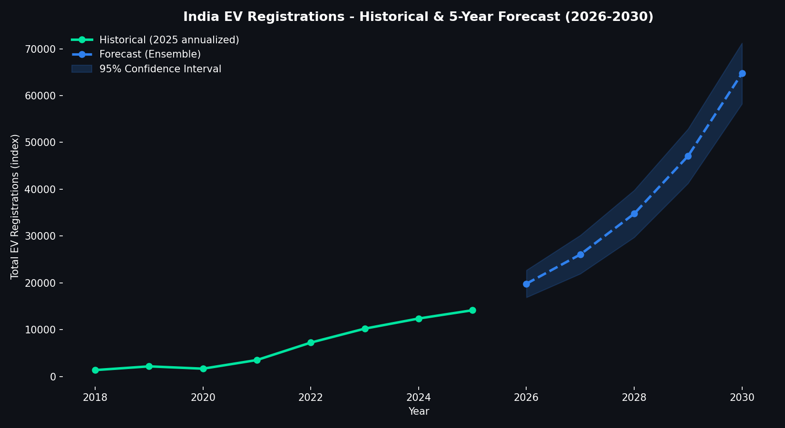
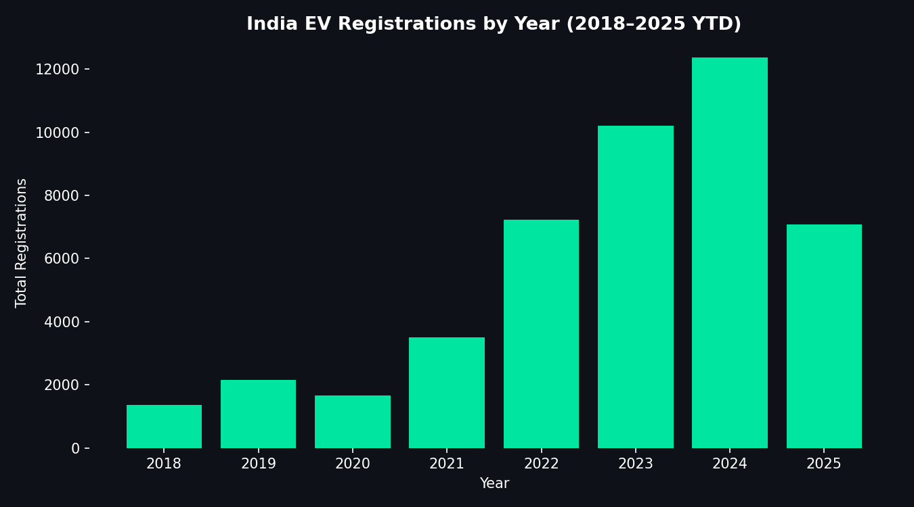
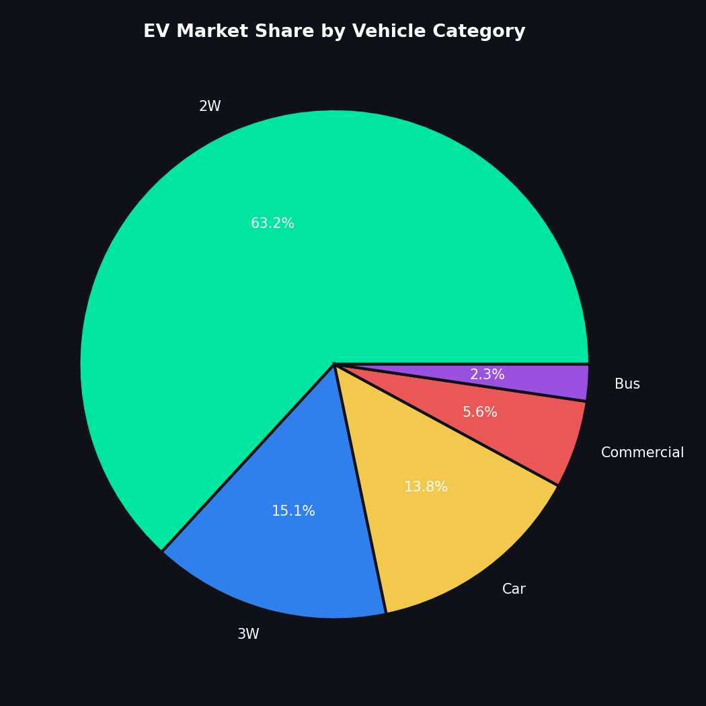
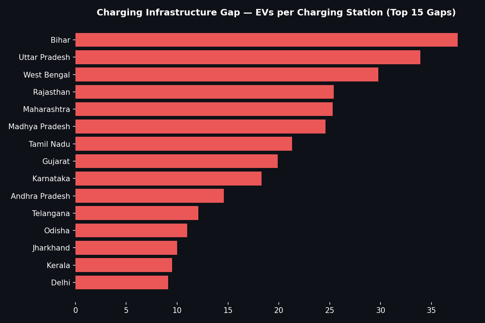

# 🔋 Driving the Future: Electric Vehicle (EV) Adoption Analysis in India

An end-to-end data analytics project covering the full pipeline — **data generation & cleaning → advanced SQL analysis → Python EDA & forecasting → Power BI executive dashboard** — analyzing India's EV adoption landscape (2018–2025) and forecasting growth through 2030.

> Built as a portfolio-grade Business Intelligence solution: the kind of dashboard a state transport department or EV policy think-tank would use to track adoption, spot infrastructure gaps, and plan investment.



---

## 📌 Project Summary

| | |
|---|---|
| **Domain** | Electric Vehicle adoption, India |
| **Time span** | Jan 2018 – Jun 2025 (historical) + forecast to 2030 |
| **Coverage** | 24 States/UTs, 5 vehicle categories, 6 manufacturers per category |
| **Records** | 7,163 cleaned rows (from 7,264 raw) |
| **Tools** | Python (Pandas, NumPy, scikit-learn, Matplotlib), SQL (CTEs, window functions), Power BI (DAX, star schema, drill-through) |

**Note:** The dataset is synthetically generated to realistically model publicly reported India EV adoption patterns (state-tier variation, FAME-II-era acceleration, COVID-era 2020 dip, festive-season seasonality) — built for portfolio demonstration, not sourced from an official government feed.

---

## 🎯 What This Project Demonstrates

- **Data Engineering**: reproducible cleaning pipeline (deduplication, state-name standardization, missing-value imputation, IQR outlier treatment) implemented in both Python *and* SQL.
- **Advanced SQL**: CTEs, window functions (`RANK`, `LAG`, `NTILE`), YoY growth, market share, infrastructure-gap analysis — see [`sql/03_analysis_queries.sql`](sql/03_analysis_queries.sql).
- **Forecasting**: an ensemble of log-linear (compound growth) regression and a custom damped Holt's trend model, with a 95% confidence interval — see [`python/03_forecasting_model.py`](python/03_forecasting_model.py).
- **BI Dashboard Design**: a 6-page, dark-themed, drill-through-enabled Power BI dashboard spec with full DAX measure library — see [`powerbi/`](powerbi/).
- **Business Storytelling**: insights and recommendations tied directly to the data — see [`docs/business_insights.md`](docs/business_insights.md).

---

## 🗂️ Repository Structure

```
EV_Adoption_India_Analysis/
├── data/                    → raw + cleaned datasets, forecast output
├── sql/                     → schema, cleaning, advanced analysis queries
├── python/                  → data generation, cleaning, EDA, forecasting
├── powerbi/                 → dashboard layout spec + DAX measures
├── assets/                  → exported charts (PNG)
├── docs/                    → architecture, insights, LinkedIn/résumé copy
├── data_dictionary.md
└── README.md
```

---

## 🔧 Pipeline

```
Raw CSV → Python Cleaning → Cleaned CSV → [SQL Analysis] + [Python EDA/Forecast] → Power BI Star Schema → 6-Page Dashboard
```
Full architecture diagram: [`docs/project_architecture.md`](docs/project_architecture.md)

### Reproduce it locally
```bash
pip install pandas numpy scikit-learn matplotlib

python python/00_generate_dataset.py     # generates raw synthetic data
python python/01_data_cleaning.py        # cleans → data/cleaned/
python python/02_eda_analysis.py         # EDA charts → assets/
python python/03_forecasting_model.py    # forecast → data/cleaned/ + assets/
```
Then load `data/cleaned/ev_registrations_cleaned.csv` and `ev_forecast_2026_2030.csv` into Power BI Desktop, apply the star schema and DAX from `powerbi/`, and build the pages per `powerbi/dashboard_layout.md`.

---

## 📊 Key KPIs Tracked

- Total EV Registrations · Total Charging Stations · YoY Growth Rate
- State-wise ranking (Top 10 / Bottom 10) with quartile segmentation
- Vehicle category market share (2W / 3W / Car / Bus / Commercial)
- EV-to-Charging-Station ratio (infrastructure gap indicator)
- Manufacturer market share by category
- Monthly/yearly/seasonal trend analysis
- 5-year forecast (2026–2030) with confidence interval

---

## 📈 Sample Visuals

| National Trend | Category Market Share | Infrastructure Gap |
|---|---|---|
|  |  |  |

Full Power BI dashboard design spec (6 pages, dark theme, drill-through, bookmarks): [`powerbi/dashboard_layout.md`](powerbi/dashboard_layout.md)

---

## 💡 Headline Insights

- **Uttar Pradesh, Maharashtra, Tamil Nadu, Gujarat, Karnataka** lead in total EV registrations.
- **Two-wheelers hold ~63% market share**, but **buses and commercial vehicles are growing fastest** (CAGR ~98% and ~74% respectively, off a small base).
- **Bihar, UP, West Bengal, Rajasthan, and Maharashtra** show the widest EV-to-charging-station gap — the top infrastructure investment priority.
- **Bajaj Auto, Ola Electric, and Hero Electric** lead overall volumes; **Tata Motors** leads the Car and Commercial segments.
- National EV registrations are projected to grow from ~14,100 (2025, annualized) to **~64,700 by 2030** — a projected CAGR of ~32%, moderating from ~42% historically as the market matures.

Full write-up with recommendations: [`docs/business_insights.md`](docs/business_insights.md)

---

## 🛠️ Tech Stack

`Python` `Pandas` `NumPy` `scikit-learn` `Matplotlib` `SQL` `Power BI` `DAX`

---

## 📄 License / Data Disclaimer

This project uses a synthetically generated dataset for educational/portfolio purposes and does not represent official Government of India (Vahan/MoRTH) data. Methodology and folder structure are freely reusable — feel free to fork and adapt to a real dataset (e.g. the [Vahan Dashboard](https://vahan.parivahan.gov.in/)).

---

## 👤 Author

Built as a portfolio project demonstrating an end-to-end analytics workflow — data cleaning, SQL, Python forecasting, and BI dashboard design — for Data Analyst / Data Scientist / BI Developer roles.
